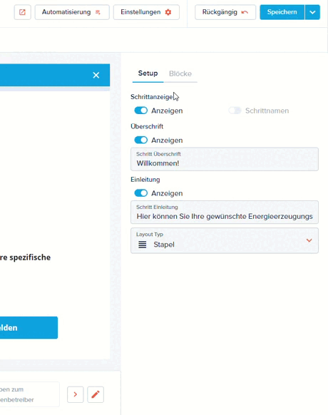
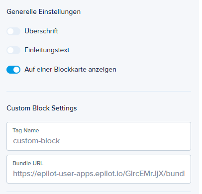
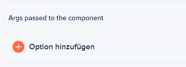

# epilot Journey SDK
[](https://www.npmjs.com/package/@epilot/epilot-journey-sdk)

epilot Journey SDK is a tool that allows developers to create Custom Blocks for the epilot Journey Builder.

Be aware that some of the features are still experimental.

<details>
  <summary>Terminology</summary>
  <p>
    <strong>Journey Builder:</strong> is a tool for building flexible Journeys in the 360 epilot platform.
  </p>
  <p>
    <strong>The configuring user:</strong> is a user of epilot 360 that has access to the tool Journey Builder.
  </p>
</details>

## Custom Block for epilot Journeys
> **Warning**
> 
> This feature is an experimental one. Therefore to have it available to your organisation, please contact epilot to enable it.

This document is intended to be a guide for configuring users to configure Custom Blocks in the epilot Journey Builder.

Apart from this document, examples are available in the [examples](./examples) folder. They include how to develop a web component and how to use it in the Journey Builder.
* [Hello World](./examples/hello-world-block): this is a simple block that displaying a static message.
* [Counter](./examples/counter-block): this is a more complex block that takes data from the journey, manupilate it and sends its data back to the journey.
* [Theming](./examples/theming): another simple example, it shows how to take advantage of the theme object that the journey passes to the block.
* [Required and Errors](./examples/required-errors-block): another simple example, it shows how the journey will communicate to the block that its data is required. And also shows how when the user is trying to skip filling the data, the journey will instricut the block to show an error message.

### What are Custom blocks?
epilot through the 360 tool Journey Builder providers numerous amounts of block which are easy to be used and provides a UI method to configure them. Despite that, the business case could be too special or too complex for a generic solution and a custom solution might be needed.

The epilot Journey SDK allows developers to develop a custom solution (standard web component) that could be integrated to the Journey as a block. This block will be able to receive configuration like any other block, in addition it will be able to communicate back its data to the Journey

### How do Custom Blocks work?
In a general perspective, the epilot Journey allows the user to add a wrapper block to it, this wrapper block will load a JS bundle which contains a web component. The wrapper block will ensure that the bundle will be able to receive configuration, data, error messages and sent data back.

Since the Custom Block wrapper is a Journey block, the configuring user will be able to apply display logics like any block.

#### How does the Custom Block communicate with the Journey?
The Custom Block wrapper expects the implementation to be a standard web component. The wrapper will pass multiple props to the component. They are documented as typescript type as the following:
```typescript
type ControlledCustomBlockProps<T> = {
  setValue: React.Dispatch<T>
  value: T
  errors?: string
  required?: boolean
  args?: string
}
```

### How to use the Custom Block?
As a configuring user, please head to the [Journey Builder](https://portal.epilot.cloud/app/entity/journey), and open the Journey.
In the desired step, add a new custom block (as in the following GIF).



### How to configure the Custom Block?

Since the Custom Block is going to be implemented as a web component. You must set the tag name and point to the bundle URL. The URL can be a local URL during development or a deployed bundle.



**Tip:** make sure to use an SSL secure bundle for production.

#### How to pass extra arguments to the Custom Block?
It is mainly used in some cases, when the implementation of the block might need variables to be used that the configuration user would like to control (such as an API token, a subscription id, extra URLs... etc.)
In the block configurator, the configuring user can pass the data as key & value pairs in the UI. This is done by clicking on the button "Add an Option"



## Coming Soon
1. [ ] adding more examples:
    - [x] 2 ways communication between the block and the journey
    - [x] example about being required and using errors
    - [x] using the epilot theme to make your app look native
    - [ ] using a new feature called "read-only journey data" where the custom block will see the data of other blocks but read-only
    - [ ] using args
2. [ ] improve the docs
3. [ ] how to request a feature
4. [ ] instructions for developers
5. [ ] improve the configurator side
