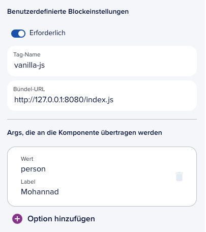

# Vanilla JS block

This simple block is made with 0 libraries.

to use it. run the following command to start a local server
```
npm start
```

## Getting Started

Configure your custom block in the Journey Builder for local development:



Point Bundle URL to `http://127.0.0.1:8080/index.js` and use the Tag name `vanilla-js` as configured at the end of `./index.js`

## How this example works?
The Object is extending `HTMLElement` to create a web component later at line 82.

One must declear the props that are needed from epilot journey as `static observedAttributes = [...]`, unless specified there, no updates will be pushed to the component.

Also the function `attributeChangedCallback` is updating the component Object with the needed props.

The rest is just business logic constructing some html and consuming the props. such as error display and the theme.