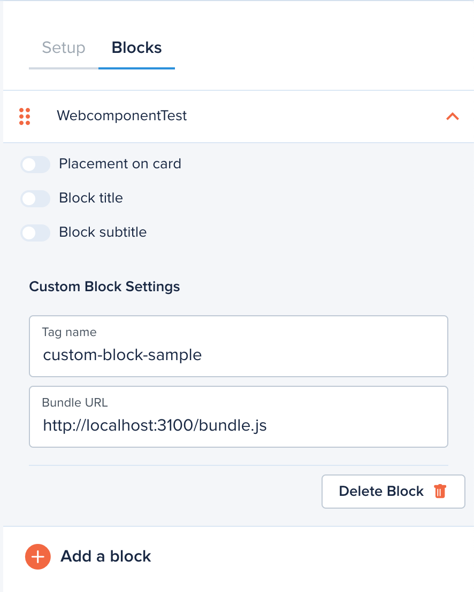

# Hello World BLock

This is a very simple block that displays Hello World, it is built using React and [Direflow](https://direflow.io/)

```
npm install
npm start
```

## Getting Started

Configure your custom block in the Journey Builder for local development:



Point Bundle URL to `http://localhost:3000/static/js/bundle.js` and use the Tag name `hello-wc` as configured in `./src/index.tsx`

